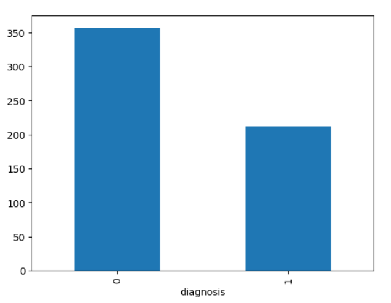
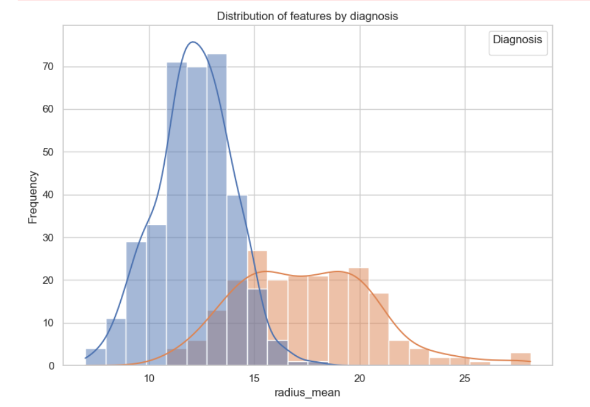
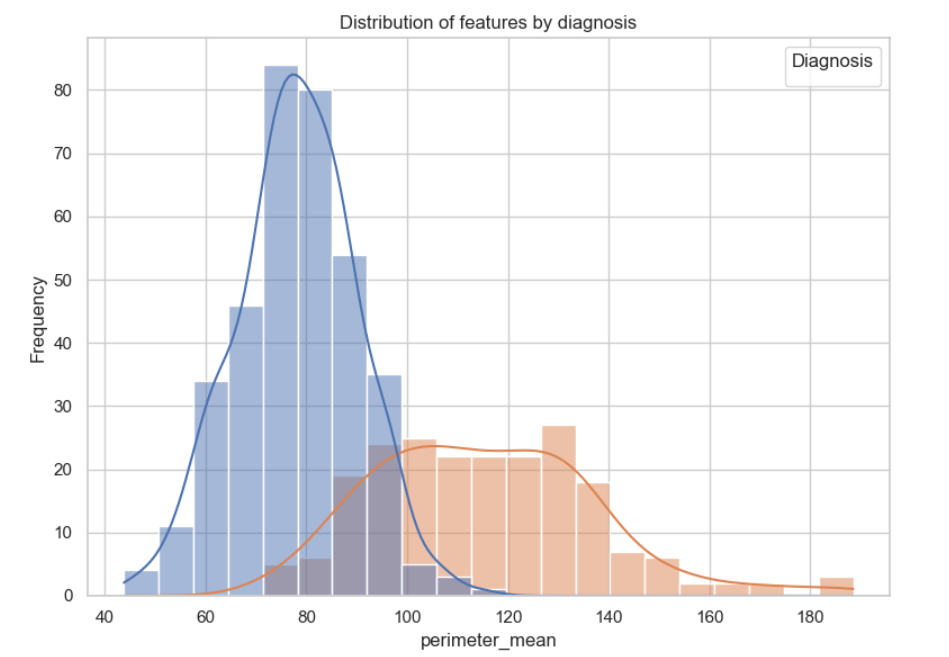
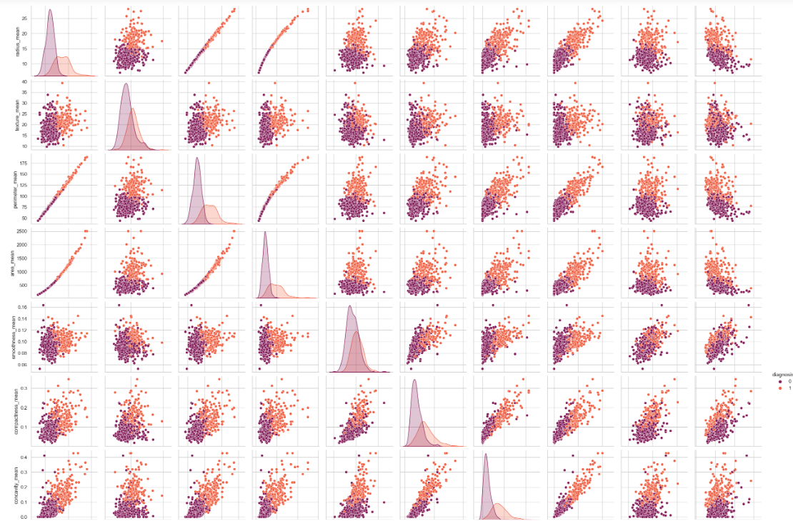
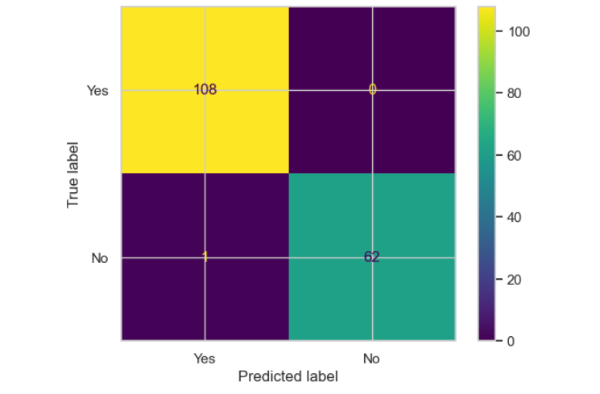

# Breast Cancer Diagnosis Predictor
## Overview
The Breast Cancer Diagnosis predictor is a machine learning tool designed to assist in diagnosing breast cancer. Using a set of measurements, the app predicts whether a breast mass is benign or malignant. The app can be used by inputting the measurements. 

## Usage
To start the app, simply run the following command:
#### streamlit run predict.py 
This will launch the app in your default browser. You can then input the measurements, and click the button to view the result.

# Exploratory Data Analysis / Prediction

